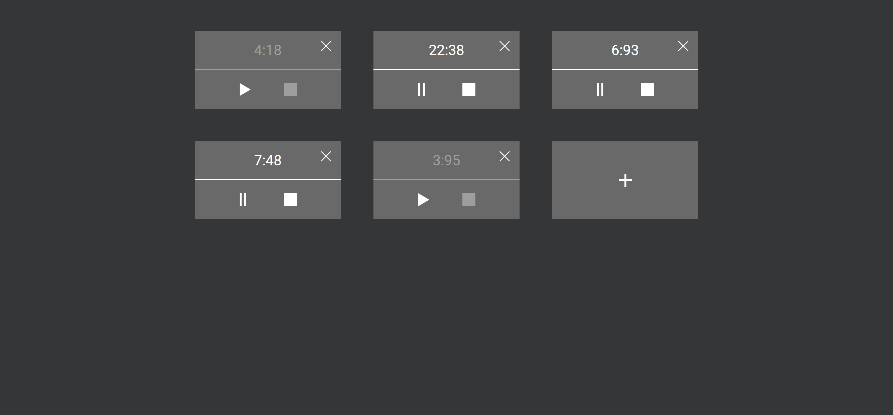

# v-stopwatch


</br>
<div align="center">
  <a href="https://v-stopwatch-list.vercel.app/">
    
  </a>

  [](https://v-stopwatch-list.vercel.app/)

  <h3 align="center">V-Stopwatch</h3>

  <p align="center">
    Watch your time!
    <br />
    <a href="https://v-stopwatch-list.vercel.app/">View Demo</a>
    ·
    <a href="https://github.com/steelWinds/v-stopwatch-list/issues">Report Bug</a>
    ·
    <a href="https://github.com/steelWinds/v-stopwatch-list/issues">Request Feature</a>
  </p>
</div>

# About The Project

<div align="center">
  <a href="https://v-stopwatch-list.vercel.app/">
    
  </a>
</div>

Simple stopwatch PWA app, try it!

### Built with
[](https://pnpm.io/)
[](https://tailwindcss.com/)
[](https://vitejs.dev/)
[](https://vuejs.org/)

## Getting Started

### Installation
1. Clone the repo
   ```bash
   git clone https://github.com/steelWinds/v-stopwatch-list
   ```
2. Install NPM packages (with **pnpm** manager)
   ```bash
   pnpm install
   ```
3. Build project
   ```bash
   pnpm build
   ```
3. Run project!
   ```bash
   pnpm preview
   ```
## License

Distributed under the MPL License. See LICENSE.txt for more information.

## Contact

[@steelWinds](https://github.com/steelWinds) | kirillsurov0@gmail.com | [t.me/bladeVrtx](https://t.me/bladeVrtx)
